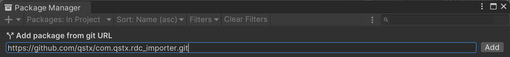
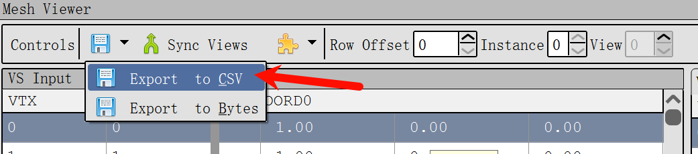
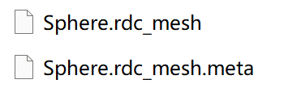
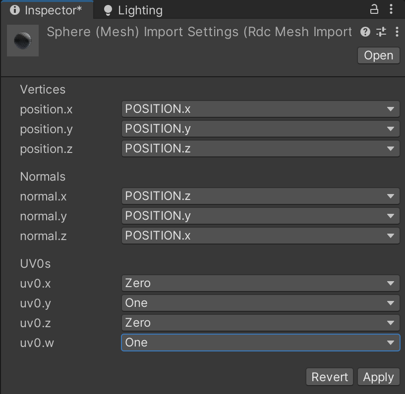

# com.qstx.rdc_importer

Import RenderDoc CSV Mesh Files in Unity

## 1. Install

Install this Plugin in Unity Package Manager.

Open [Window > Package Manager > Add Package from git URL] and input *https://github.com/qstx/com.qstx.rdc_importer.git*.

## 2. How to use

- Export mesh to csv file in RenderDoc.

- Rename file extension form csv to rdc_mesh and Drag it into Unity.

- Change the settings in the Import Panel and Apply.

